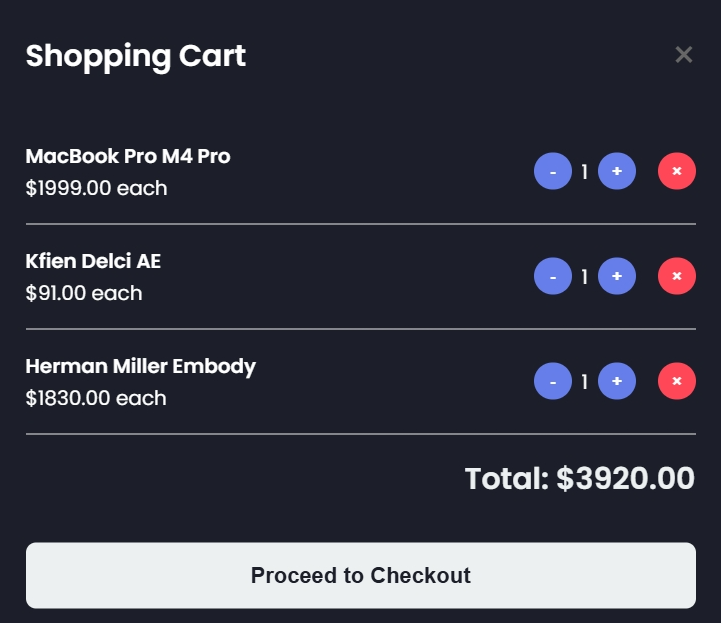
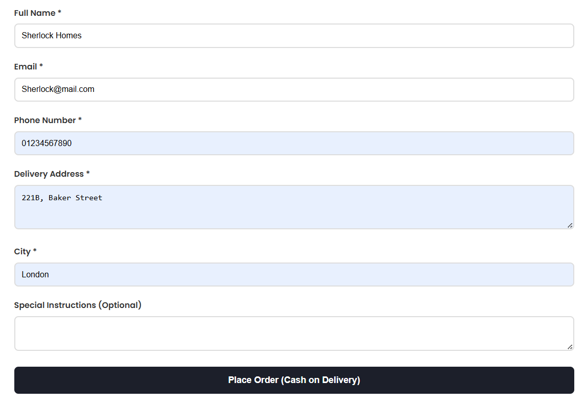

# LocalMart - E-commerce Platform

A modern, responsive e-commerce web application designed to support local businesses and provide customers with a seamless shopping experience.

## Features

### 🛒 Core E-commerce Functionality
- Product catalog with descriptions and pricing
- Advanced search with filters (price range, sorting)
- Shopping cart with quantity management
- Secure user authentication (login/register)
- Order placement with cash-on-delivery payment

### 🎨 User Experience
- Modern, clean interface with smooth animations
- Real-time cart updates
- Session-based user management
- Contact form for customer inquiries

### 🔍 Search & Navigation
- Live product search functionality
- Price range filters
- Sort by name or price (ascending/descending)
- Clear search results with count display

## Technology Stack

### Frontend
- **HTML5** - Semantic markup
- **CSS3** - Modern styling with Flexbox/Grid
- **Vanilla JavaScript** - Dynamic functionality
- **Google Fonts** - Typography (Poppins)

### Backend
- **PHP 7.4+** - Server-side logic
- **MySQL** - Database management
- **PDO** - Database abstraction layer
- **Session Management** - User authentication

## Installation

### Prerequisites
- PHP 7.4 or higher
- MySQL 5.7 or higher
- Web server (Apache/Nginx)
- Modern web browser

### Setup Instructions

1. **Clone the repository**
   ```bash
   git clone https://github.com/mkjabed/localmart.git
   cd localmart
   ```

2. **Database Setup**
   ```sql
 -- Create the main database if it doesn't exist
CREATE DATABASE IF NOT EXISTS ecommerce_db;
USE ecommerce_db;

-- ===============================
-- Users Table
-- Stores information about registered users (customers/admins)
-- ===============================
CREATE TABLE IF NOT EXISTS users (
    id INT AUTO_INCREMENT PRIMARY KEY,
    name VARCHAR(100) NOT NULL,
    email VARCHAR(100) NOT NULL UNIQUE,
    password VARCHAR(255) NOT NULL,
    role ENUM('admin', 'customer') DEFAULT 'customer',
    created_at TIMESTAMP DEFAULT CURRENT_TIMESTAMP
) ENGINE=InnoDB DEFAULT CHARSET=utf8mb4;

-- ===============================
-- Products Table
-- Stores product details (name, price, stock, description, image)
-- ===============================
CREATE TABLE IF NOT EXISTS products (
    id INT AUTO_INCREMENT PRIMARY KEY,
    name VARCHAR(255) NOT NULL,
    price DECIMAL(10,2) NOT NULL,
    description TEXT,
    image VARCHAR(255),
    stock INT DEFAULT 0,
    created_at TIMESTAMP DEFAULT CURRENT_TIMESTAMP
) ENGINE=InnoDB DEFAULT CHARSET=utf8mb4;

-- ===============================
-- Orders Table
-- Stores order details (customer info, payment, status, linked to user)
-- ===============================
CREATE TABLE IF NOT EXISTS orders (
    id INT AUTO_INCREMENT PRIMARY KEY,
    customer_name VARCHAR(255) NOT NULL,
    email VARCHAR(255) NOT NULL,
    phone VARCHAR(20) NOT NULL,
    address TEXT NOT NULL,
    city VARCHAR(100) NOT NULL,
    notes TEXT,
    total DECIMAL(10,2) NOT NULL,
    payment_method VARCHAR(50) DEFAULT 'Cash on Delivery',
    status VARCHAR(50) DEFAULT 'pending',
    order_date TIMESTAMP DEFAULT CURRENT_TIMESTAMP,
    user_id INT,
    FOREIGN KEY (user_id) REFERENCES users(id) ON DELETE SET NULL
) ENGINE=InnoDB DEFAULT CHARSET=utf8mb4;

-- ===============================
-- Order Items Table
-- Stores the individual products included in each order
-- (Linked to both orders and products)
-- ===============================
CREATE TABLE IF NOT EXISTS order_items (
    id INT AUTO_INCREMENT PRIMARY KEY,
    order_id INT,
    product_id INT,
    product_name VARCHAR(255) NOT NULL,
    quantity INT NOT NULL,
    price DECIMAL(10,2) NOT NULL,
    FOREIGN KEY (order_id) REFERENCES orders(id) ON DELETE CASCADE,
    FOREIGN KEY (product_id) REFERENCES products(id)
) ENGINE=InnoDB DEFAULT CHARSET=utf8mb4;

-- ===============================
-- Insert Sample Products
-- Example items added into the products table
-- ===============================
INSERT INTO products (name, price, description, image, stock, created_at) VALUES
('Rainy 75 Keyboard', 129.99, 'Best-selling Audiophile Keyboard', 'rainy75.webp', 50, NOW()),
('Razor Pro Click', 98.00, 'Ultra-precise productivity mouse', 'razor-pro-click.jpg', 30, NOW()),
('Herman Miller Embody', 1830.00, 'Premium chair for all-day comfort', 'embody.jpg', 100, NOW()),
('Kfien Delci AE', 91.00, 'Best-in-class Audiophile Grade IEM', 'kfine.webp', 75, NOW()),
('PS5 Slim', 449.00, 'Next-gen gaming beast', 'ps5.webp', 40, NOW()),
('MacBook Pro M4 Pro', 1999.00, 'XDR display, M4 power, all-day battery', 'mac.avif', 25, NOW());

-- ===============================
-- Insert Sample User
-- Example customer added into the users table
-- ===============================
INSERT INTO users (name, email, password, role, created_at) VALUES
('Mustofa Kamal Jabed', 'jabed.mu.cse@gmail.com', '$2y$10$j3Dzv2MfzW95rasoZKJ/SewFIxpemfcDdt8bRDN3QiLm4TH1txMiK', 'customer', NOW());

-- ===============================
-- Contact Messages Table
-- Stores messages sent by users via the contact form
-- ===============================
CREATE TABLE IF NOT EXISTS contact_messages (
    id           INT AUTO_INCREMENT PRIMARY KEY,
    name         VARCHAR(100) NOT NULL,
    email        VARCHAR(100) NOT NULL,
    subject      VARCHAR(255) NOT NULL,
    message      TEXT NOT NULL,
    submitted_at TIMESTAMP DEFAULT CURRENT_TIMESTAMP,
    status       ENUM('unread', 'read', 'replied') DEFAULT 'unread'
) ENGINE=InnoDB DEFAULT CHARSET=utf8mb4;
 ```


3. **Configure Database Connection**
   
   Edit `config.php` with your database credentials:
   ```php
   $host = 'localhost';
   $dbname = 'ecommerce_db';
   $username = 'your_username';
   $password = 'your_password';
   ```

4. **Set Up Product Images**
   
   Create an `assets` directory and add product images:
   ```bash
   mkdir assets
   # Add your product images to this directory
   ```

## File Structure

```
localmart/
├── assets/                # Product images
├── screenshots/           # Website screenshots
├── config.php             # Database configuration
├── index.html             # Homepage
├── about.html             # About page
├── contact.html           # Contact page
├── login_register.html    # Authentication page
├── style.css              # Main stylesheet
├── login.php              # Login handler
├── register.php           # Registration handler
├── logout.php             # Logout handler
├── session_check.php      # Session validation
├── products.php           # Products API
├── search.php             # Search functionality
├── submit_order.php       # Order processing
├── submit_contact.php     # Contact form handler
├── get_orders.php         # Order retrieval (admin)
└── README.md              # This file
```

## Usage

### Customer Features
1. **Browse Products**: Visit the homepage to view featured products
2. **Search**: Use the search bar to find specific items
3. **Register/Login**: Create an account to access cart functionality
4. **Add to Cart**: Click "Add to Cart" on desired products
5. **Checkout**: Review cart and place order with delivery details
6. **Contact**: Use the contact form for inquiries

### Admin Features
- Order management through `get_orders.php`
- Product management (requires custom admin interface)

## API Endpoints

| Endpoint | Method | Description |
|----------|--------|-------------|
| `/products.php` | GET | Retrieve all products |
| `/products.php?search=term` | GET | Search products |
| `/search.php` | GET | Advanced search with filters |
| `/submit_order.php` | POST | Place new order |
| `/submit_contact.php` | POST | Submit contact message |
| `/session_check.php` | GET | Check login status |
| `/login.php` | POST | User authentication |
| `/register.php` | POST | User registration |

## Contributing

1. Fork the repository
2. Create a feature branch (`git checkout -b feature/new-feature`)
3. Commit your changes (`git commit -am 'Add new feature'`)
4. Push to the branch (`git push origin feature/new-feature`)
5. Create a Pull Request

## Security Features

- Password hashing using PHP's `password_hash()`
- SQL injection prevention using PDO prepared statements
- Session-based authentication
- Input validation and sanitization
- CSRF protection ready (can be enhanced)

## Browser Support

- Chrome 70+
- Firefox 65+
- Safari 12+
- Edge 79+

## Screenshots


*Homepage with product catalog and search functionality*


*Shopping cart with quantity controls*


*Order placement form with customer details*

---

**LocalMart** - Shop Smart. Live Local.
